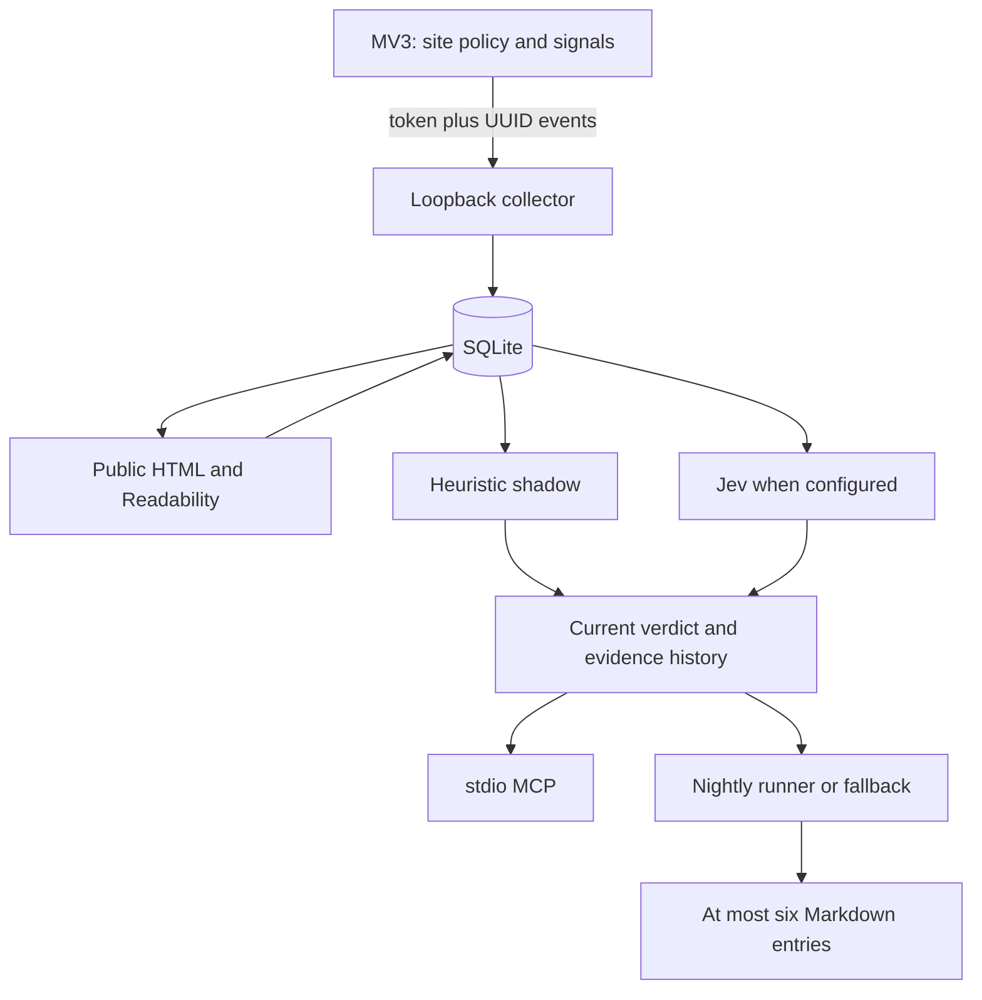
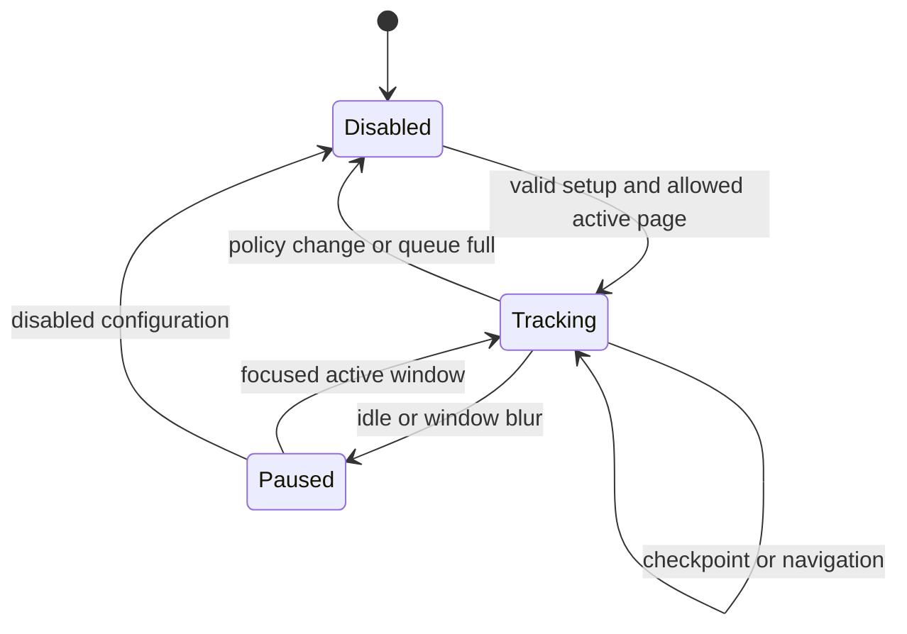
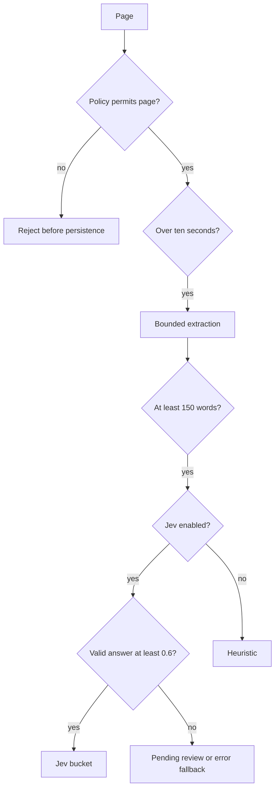

# Attention Log local trial

## Goal Capsule

- Objective: Help the user decide which recently browsed pages deserve another visit and close the other tabs without losing valuable material.
- Means: A local attention log, parallel heuristic/Jev classification, and a Markdown digest of at most six pages (KTD1–KTD6).
- Authority: The user request and supplied spec govern product intent; this plan resolves the spec's contradictions.
- Execution: Implement and verify locally on a feature branch. No publication or automatic installation into the user's browser or login services.
- Stop conditions: Never bypass exclusions or enable external transmission to make a test pass. Missing credentials block live provider verification, not local implementation.
- Completion owner: This session delivers working code, plan, tests, setup instructions, and explicit remaining live-trial checks.

---

## Product Contract

### Summary

Build the self-contained variant A for a two-week trial. Capture attention signals without page content in the extension; enrich eligible public pages locally; expose summaries and details through MCP; create a short daily Markdown digest. Jev remains a supported classifier from v0, with a working offline fallback.

### Problem Frame

Browser history records visits, while saved bookmarks record explicit choices. Neither helps the user decide which of this week's half-read material deserves attention. The unresolved product hypothesis is whether passive behavioral signals yield a useful short list.

### Requirements

| ID | Requirement | Origin |
|---|---|---|
| R1 | Exclude sensitive URLs before browser persistence/transmission; enforce the same policy at the collector and enrichment boundary. Capture is off until configured. | Privacy |
| R2 | Track only the selected tab in the focused window while the system is active. Survive worker restart, batch retry, navigation, idle, and closure without counting inactive time twice. | MV3 |
| R3 | Persist normalized pages, separate visits, gesture signals, event receipts, and verdict history in local SQLite. | Schema/collector |
| R4 | Enrich pages after more than ten seconds of active attention; never fetch private networks or redirect into excluded URLs. Bound time, bytes, retries, and excerpt size. | Collector/privacy |
| R5 | Compute the heuristic for all pages. Send every eligible enriched page to Jev when explicitly configured, without a score gate. Below 150 words is ineligible. Low confidence is pending review; API failure uses the heuristic. | Scoring/Jev |
| R6 | Human corrections prevail over automatic updates. Preserve model and heuristic evidence for comparison. | Verdicts |
| R7 | MCP exposes query_visits, get_page, set_verdict. List calls omit excerpts; detail calls include visits and signals; agent writes cannot claim human authority. | MCP |
| R8 | A nightly command produces zero to six unique pages, includes fourteen days of verdict context for the agent, and permits doczytaj only through cross-page synthesis. Model failure still produces an honest fallback digest. | Digest |
| R9 | Retain pages/verdicts; delete visits/signals/event receipts after ninety days. Store runtime data outside the repository and sync folders by default. | Retention |
| R10 | Record daily usefulness feedback and report how many evaluated lists led to a return, supporting the two-week decision. | Success criterion |

### Success Criteria

After fourteen days, at least half of evaluated daily digests contain a page the user actually returns to, and the user reports less reluctance to close tabs. This cannot be validated by implementation tests. Start with a manual handful-of-links comparison to confirm the digest is useful before expanding capture domains.

### Scope Boundaries

The first delivery includes extension setup, collector, enrichment, scoring, Jev adapter, MCP, agent runner contract, fallback digest, feedback CLI, retention, and a non-installed scheduling example. Defer Raindrop publishing, X DOM capture, Hister integration, history import, embeddings, hosting, mobile, and sync. Raindrop and X are explicitly optional in the source's weekend plan. Hister is an alternative, not a dependency of variant A. No application dashboard.

---

## Planning Contract

### Idea assessment

**Trial.** The outcome and two-week stop rule are strong. The main risk is mistaking engagement for value: time and copied text can describe work, confusion, or distraction. Keep the heuristic visible beside model results, preserve corrections, and measure real returns. Do not claim idea validation until the trial produces evidence.

Observed project evidence: the target directory was empty, with no incumbent code, docs, local ADRs, configuration, or remote. Bun 1.3.14 is installed. Variant A therefore has no migration cost and gives one exclusion policy and one database. Hister is useful if public-page extraction proves inadequate, but adopting it now adds a second ingestion policy and URL join before testing the core hypothesis.

### Key Technical Decisions

- KTD1. **Local Bun and SQLite.** Use small TypeScript modules, runtime input validation, Readability with a DOM library, and the official MCP SDK. Bind HTTP to 127.0.0.1. A generated bearer token is required for data endpoints. Browser origins are never granted wildcard CORS. SQLite uses foreign keys and WAL.
- KTD2. **User-selected exclusion mode plus hard exclusions (updated 2026-09-20).** The user chose to exclude Gmail, ING, Cloudflare dashboards, and URLs containing settings/login/account instead of enumerating allowed sites. Support exclusion mode while retaining optional allow mode and fail-closed legacy defaults. An exhaustive sensitive-site denylist cannot be guaranteed; the shared policy also rejects credentials, secret query parameters, private/local hosts, email/payment/work tools, and configurable domains or prefixes. No content extraction in the extension. This is a deliberate conservative setup default, not a scoring gate.
- KTD3. **Durable cumulative checkpoints.** Persist worker state and pending events in storage.local, with a browser-session identifier in storage.session. Each visit has a stable ID and cumulative active milliseconds; each event has a UUID. Updates take the maximum checkpoint, not a sum. Worker wake can recover; browser restart never counts downtime. Long alarm gaps are capped and treated as possible sleep, so measurement can undercount rather than overcount. Queue overflow stops capture with a visible diagnostic.
- KTD4. **Versioned decision evidence.** A nullable bucket and review flag represent uncertainty. Append-only verdict history preserves each provider's decision and heuristic score; current verdict resolves source precedence human > agent > Jev > heuristic. New attention refreshes the score without replacing protected decisions. Returns are counted once per visit after at least one hour; the return count contributes through r, not also through g.
- KTD5. **Actual Jev Choice API.** POST state/model/questions to /v1/systemone; parse answers.bucket.choice, confidence, probabilities. Jev does not generate prose. Its reason is a transparent local template, not a fabricated model explanation. Unknown or malformed answers fall back. Model input excludes the URL and is capped to title, domain, 2,000-character excerpt and numeric evidence. [Official API](https://docs.typesafe.ai/api), [primitives](https://docs.typesafe.ai/introduction).
- KTD6. **Portable nightly agent runner.** A configured local executable receives a bounded JSON packet on stdin and returns validated JSON selections on stdout. This avoids assuming a provider or existing Codex configuration. Without a runner, rank deterministically and label the result as a fallback; do not claim semantic grouping or infer doczytaj. Validate page IDs, buckets, cardinality, duplicate selections, and required past-page evidence for doczytaj. Retain prompts and human-readable setup docs. Schedule examples invoke the same daily command.
- KTD7. **Bounded server extraction.** Resolve public addresses before connecting and pin the selected address for each request; validate every redirect. No cookies or browser credentials. Readability failure records a failed attempt and leaves title metadata available, without inventing word count. Retry with a bounded backoff; refreshed eligibility uses recorded fetch state.

The source's 200-line estimate omits lifecycle, validation, and retention work. Its model cost figures mix 25 and 150–250 pages/day; no cost promise is used as a design premise. The final reference to a heuristic gate contradicts the repeated no-gate requirement; R5 governs. A single verdict row cannot train or compare historical decisions, so evidence history is an intentional schema extension.

### High-Level Technical Design

### Assumptions and Deferred Live Checks

The user supplies allowed sites and provider credentials at setup. No real browsing log is collected during development. A local agent runner may invoke the user's chosen model; granting it access is an explicit config action. Browser focus/idle behavior, Arc previews/Spaces, and live Jev account access require a real-world trial. Neither unit tests nor model vendor benchmarks prove product usefulness.

---

## Implementation Units

### U1. Policy, contracts, and storage

**Goal:** Store reliable local evidence under a shared privacy policy. **Requirements:** R1, R3, R6, R9. **Dependencies:** none.

**Files:** package.json, tsconfig.json, src/shared/*, src/config.ts, src/store.ts, tests/policy.test.ts, tests/store.test.ts.

**Approach:** Define validated event envelopes and cumulative visits; normalize tracking parameters; create versioned tables and verdict precedence. Add local config initialization with restricted file permissions.

**Test scenarios:** Excluded URLs leave no rows; tracking variants merge; duplicate and out-of-order checkpoints cannot inflate time; gestures associate with the correct visit; human verdict survives machine updates; retention removes old raw data and keeps decisions.

**Verification:** Policy and database integration tests pass against real in-memory SQLite.

### U2. Collector and enrichment

**Goal:** Receive authenticated event batches and enrich eligible pages. **Requirements:** R1, R3–R5, R9. **Dependencies:** U1.

**Files:** src/server.ts, src/enrich.ts, src/net.ts, tests/server.test.ts, tests/enrich.test.ts.

**Approach:** Authenticate local clients, validate whole batches, reject private-network fetches, and schedule non-overlapping enrichment runs.

**Test scenarios:** Invalid token, malicious origin, oversized body, invalid batch, duplicate retry, low dwell time, private-address DNS, redirect to blocked target, oversized HTML, and empty extraction.

**Verification:** HTTP-to-SQLite integration and extraction fixtures demonstrate expected rows and failure state.

### U3. Browser attention capture

**Goal:** Produce accurate retryable visits and gestures. **Requirements:** R1–R3. **Dependencies:** U1.

**Files:** extension/*, scripts/build-extension.ts, tests/tracker.test.ts.

**Approach:** Separate a pure state reducer from Chrome bindings. Serialize all state writes. Capture focus, activation, navigation, idle, scroll, selection/copy length, and opener signals. Provide a minimal options page for token, policy mode and exclusions.

**Test scenarios:** Focus switch, background onUpdated, worker restart, browser restart, idle, navigation, long sleep gap, failed transmission, queue limit, and policy changes.

**Verification:** Reducer tests and bundled extension build pass; document live Chrome/Arc lifecycle checks separately.

### U4. Heuristics and Jev

**Goal:** Classify with observable uncertainty and fallback. **Requirements:** R5, R6. **Dependencies:** U1, U2.

**Files:** src/scoring.ts, src/jev.ts, tests/scoring.test.ts, tests/jev.test.ts.

**Approach:** Compute normalized time with a safe unknown-word-count floor, fixed gesture weights, and single-count returns. Validate provider output and preserve immutable evidence.

**Test scenarios:** Zero words; long dwell capped; copied/selected signals; low confidence; timeout, malformed response, and 429 fallback; no score gate; human precedence.

**Verification:** Mocked protocol tests verify the documented request/response shape; live provider tests are optional and labeled unverified without credentials.

### U5. MCP, digest, and trial feedback

**Goal:** Make the evidence useful to agents and the user. **Requirements:** R6–R10. **Dependencies:** U1–U4.

**Files:** src/mcp.ts, src/digest.ts, src/cli.ts, tests/mcp.test.ts, tests/digest.test.ts, scripts/demo.ts, README.md, docs/operations.md.

**Approach:** Add bounded MCP list/detail/write tools; nightly agent input with fourteen-day history; deterministic offline fallback; atomic Markdown output and recorded daily feedback. Include scheduling examples and synthetic demo.

**Test scenarios:** List omits excerpts; pagination limits and filters; missing detail; agent cannot override human; six-item cap and duplicate rejection; recurring-theme evidence required; runner timeout/failure fallback; midnight date boundaries; rerun consistency; empty day; feedback metrics.

**Verification:** Real stdio MCP handshake/tools, synthetic end-to-end pipeline, typecheck, test suite, and extension build succeed.

---

## Verification Contract

Use Bun tests for policy, lifecycle, HTTP/SQLite, extraction, classification, and digest behavior. Run strict TypeScript checking and the extension bundler. Run the synthetic demo with networking disabled for classifiers, then connect an MCP client over stdio to verify discovery, summaries, details, and protected writes. Record command outcomes in docs/verification.md.

No existing release:validate command or behavioral skill evaluation exists in this empty project. Live browser and provider tests are separate acceptance checks and must not be reported as passed by mocks.

---

## Definition of Done

All five units have working code and verification evidence; the setup guide permits a new local trial; sensitive capture and provider transmission remain opt-in; no real browsing data or secrets enter Git; abandoned code is removed. The implementation is locally reviewable without installing background services. Product validation remains the fourteen-day experiment, not an implementation completion claim.
