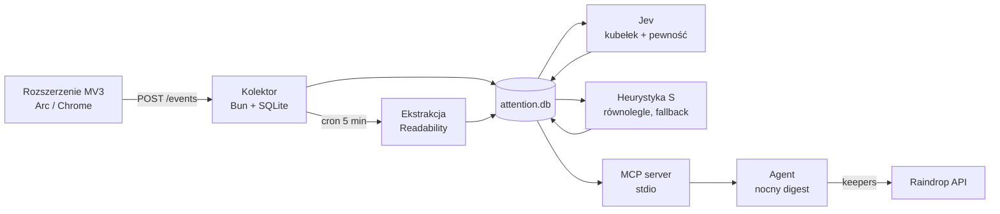

# Attention Log — specyfikacja v0

2026-09-19 · @Someone

## Cel i zakres v0

v0 odpowiada na jedno pytanie: co z tego, co w tym tygodniu przeglądałem, warto przeczytać uważnie, a co odpuścić. Nic poza tym.

W zakresie: pasywny log odwiedzin z przeglądarki, lokalna baza, ekstrakcja treści strony, prosty scoring heurystyczny, serwer MCP do odpytywania i jeden nocny przebieg produkujący krótką listę.

Jev jest częścią systemu od v0 — na start klasyfikuje każdą wzbogaconą stronę, bez bramki. Heurystyka zostaje jako wynik liczony równolegle: fallback i punkt odniesienia.

Poza zakresem świadomie: podpowiedzi na żywo w przeglądarce, embeddingi i wyszukiwanie semantyczne, aplikacja mobilna, synchronizacja między urządzeniami, hosting. Każde z nich dokłada tydzień pracy i żadne nie jest potrzebne, by sprawdzić główną hipotezę.

Kryterium sukcesu po dwóch tygodniach: w co najmniej połowie dziennych list jest przynajmniej jedna pozycja, do której faktycznie wracasz, i zamykasz karty w Arc bez poczucia straty. Jeśli nie — problem leży w scoringu albo w samym pomyśle, nie w braku funkcji.

## Architektura

Cztery warstwy, każda wymienialna osobno. Rozszerzenie tylko mierzy i wysyła, kolektor tylko przechowuje i wzbogaca, MCP tylko udostępnia, agent tylko decyduje.



Założenia stackowe: TypeScript wszędzie, Bun jako runtime kolektora (wbudowany `bun:sqlite` i serwer HTTP, zero zależności na start), SQLite jako jedyny magazyn, MCP przez stdio. Jeśli wolisz Node, różnica to `better-sqlite3` zamiast `bun:sqlite` — reszta bez zmian.

Jedna decyzja projektowa warta świadomości: schemat trzymamy w czystym SQLite bez rozszerzeń, bo to zostawia otwartą drogę do Cloudflare D1 pod koniec, gdybyś jednak chciał to wystawić poza laptop. Nie używaj więc FTS5 ani JSON1 w v0, dopóki nie jesteś pewien, że zostajesz lokalnie.

## Rozszerzenie MV3

Rozszerzenie nie ma logiki produktowej — produkuje strumień zdarzeń i nic więcej. Cała interpretacja dzieje się później, po stronie kolektora, bo tam łatwiej ją zmieniać bez przeładowywania rozszerzenia.

| Zdarzenie | Źródło | Co niesie |
| --- | --- | --- |
| `visit_start` | `chrome.tabs.onActivated`, `onUpdated` | tabId, url, title, ts |
| `visit_end` | zmiana karty, zamknięcie, `chrome.idle.onStateChanged` | tabId, ts, powód zakończenia |
| `scroll` | content script, throttling 1 s | max scroll w procentach, wysokość dokumentu |
| `selection` | content script, `selectionchange` + `copy` | długość zaznaczenia, czy było kopiowanie |
| `link_open` | `chrome.tabs.onCreated` z `openerTabId` | url źródłowy, url docelowy |

Pomiar realnego czasu jest jedynym miejscem, gdzie trzeba być uważnym. Czas liczymy tylko wtedy, gdy karta jest aktywna w aktywnym oknie i system nie jest bezczynny — `chrome.idle.setDetectionInterval(60)` i zatrzymanie licznika na `idle` oraz `locked`. Service worker w MV3 jest usypiany po około 30 sekundach, więc nie trzymaj stanu w zmiennych modułu: każde zdarzenie zapisuj natychmiast do `chrome.storage.session`, a wysyłkę rób paczkami przez `chrome.alarms` co minutę. To najczęstsze źródło zgubionych danych w tego typu rozszerzeniach.

Gesty intencjonalne — zaznaczenie tekstu dłuższe niż 40 znaków, kopiowanie, otwarcie linku w nowej karcie, powrót na ten sam URL po co najmniej godzinie — są w scoringu ważniejsze niż czas i dlatego lecą jako osobne zdarzenia, nie jako pola wizyty.

Arc jest oparty na Chromium, więc rozszerzenie działa bez zmian, ale ma dwie właściwości warte przetestowania od razu: Live Folders i karty w Spaces potrafią generować `onUpdated` bez faktycznej aktywacji, a „podgląd” linku nie zawsze daje `onActivated`. Jedno popołudnie z `console.log` na zdarzeniach powie ci więcej niż jakakolwiek dokumentacja.

## Schemat bazy

Cztery tabele. `pages` to tożsamość treści, `visits` to pojedyncze wejścia, `signals` to gesty, `verdicts` to decyzje twoje i agenta.

```sql
CREATE TABLE pages (
  id          INTEGER PRIMARY KEY,
  url_norm    TEXT NOT NULL UNIQUE,   -- bez utm_*, fbclid, ref, #fragment
  url_raw     TEXT NOT NULL,
  domain      TEXT NOT NULL,
  title       TEXT,
  excerpt     TEXT,                   -- Readability: pierwsze ~2000 znaków
  word_count  INTEGER,
  lang        TEXT,
  fetched_at  INTEGER,                -- NULL = jeszcze nie wzbogacone
  first_seen  INTEGER NOT NULL,
  last_seen   INTEGER NOT NULL
);

CREATE TABLE visits (
  id          INTEGER PRIMARY KEY,
  page_id     INTEGER NOT NULL REFERENCES pages(id),
  started_at  INTEGER NOT NULL,
  active_ms   INTEGER NOT NULL DEFAULT 0,
  max_scroll  REAL DEFAULT 0,         -- 0.0-1.0
  end_reason  TEXT                    -- switch | close | idle | lock
);

CREATE TABLE signals (
  id          INTEGER PRIMARY KEY,
  visit_id    INTEGER NOT NULL REFERENCES visits(id),
  kind        TEXT NOT NULL,          -- select | copy | open_link | return
  weight      REAL NOT NULL DEFAULT 1,
  ts          INTEGER NOT NULL
);

CREATE TABLE verdicts (
  page_id     INTEGER PRIMARY KEY REFERENCES pages(id),
  heur_score  REAL NOT NULL,          -- S z filtru wstepnego, zawsze liczone
  bucket      TEXT NOT NULL,          -- czytaj | utrwal | doczytaj | zapomnij
  confidence  REAL,                   -- pewnosc Jeva, NULL dla heurystyki
  source      TEXT NOT NULL,          -- jev | heuristic | agent | human
  reason      TEXT,
  decided_at  INTEGER NOT NULL
);

CREATE INDEX idx_visits_page ON visits(page_id);
CREATE INDEX idx_visits_time ON visits(started_at);
CREATE INDEX idx_pages_domain ON pages(domain);
```

Trzy decyzje, które wyglądają na drobiazgi, a decydują o jakości danych. Normalizacja URL-a przed zapisem — bez niej ten sam artykuł z trzech źródeł to trzy osobne strony i scoring rozjedzie się na starcie. Wizyty zostają rozdzielone zamiast agregowane do strony, bo „trzy powroty po pięć minut” to zupełnie inny sygnał niż „jedno wejście na kwadrans”. I `verdicts` z kolumną `source`, żeby twoja ręczna korekta nadpisywała agenta i mogła później posłużyć jako zbiór treningowy albo few-shot dla Jeva.

## Kolektor

Kolektor to jeden proces na `localhost:3030` z trzema endpointami i jednym zadaniem w tle. Całość mieści się w około 200 linijkach.

| Endpoint | Metoda | Rola |
| --- | --- | --- |
| `/events` | POST | przyjmuje paczkę zdarzeń z rozszerzenia, idempotentnie po `client_event_id` |
| `/health` | GET | rozszerzenie sprawdza, czy warto buforować czy wysyłać |
| `/verdict` | POST | ręczna korekta z digestu lub z CLI |

Wzbogacanie chodzi osobno, co pięć minut: bierze strony z `fetched_at IS NULL`, które mają łącznie ponad 10 sekund aktywnego czasu, pobiera HTML i przepuszcza przez Readability, zapisuje `excerpt`, `word_count` i `lang`. Próg czasowy jest po to, żeby nie pobierać setek stron, przez które tylko przeleciałeś — przy normalnym dniu to różnica między trzydziestoma a trzystoma requestami.

Pobieranie serwerowe ma jedno znane ograniczenie: strony za loginem, paywallem i ciężkie SPA zwrócą śmieci. W v0 to akceptujemy i zostawiamy `excerpt` pusty — agent poradzi sobie z samym tytułem i domeną. Alternatywa, czyli wyciąganie DOM-u przez content script, działa lepiej, ale oznacza wysyłanie treści każdej odwiedzonej strony, w tym firmowych panelów — to świadomie odkładamy do momentu, w którym lista wykluczeń będzie dojrzała.

X i inne serwisy z treścią w DOM-ie obsłuż wyjątkiem: dla `x.com` content script kopiuje tekst posta, przy którym zatrzymałeś się dłużej niż 15 sekund, i wysyła go jako `excerpt`. Nie próbuj przechwytywać całego timeline'u — to jest dokładnie ta ścieżka, na której projekt umiera.

## Scoring v0

Na start do Jeva idzie wszystko, co zostało wzbogacone — żadnej bramki. Heurystyka liczy się dla każdej strony równolegle i pełni dwie role: wypełnia kubełek, kiedy API nie odpowie, i daje punkt odniesienia do sprawdzenia, czy model faktycznie bije prostą formułę.

Formuła zostaje więc w systemie w niezmienionej postaci, zmienia się tylko jej rola — z decyzji na cień.

```latex
S = 2.0 \cdot g + 1.2 \cdot r + 0.8 \cdot \min\left(\frac{t}{t_{exp}}, 2\right) + 0.5 \cdot d
```

Gdzie `g` to suma wag gestów intencjonalnych, `r` to liczba powrotów na stronę w różnych sesjach, `t` to łączny aktywny czas, a `d` to maksymalna głębokość scrolla. Kluczowy jest mianownik: `t_exp` to oczekiwany czas czytania, czyli `word_count / 240` minut. Dzięki temu pięć minut na krótkim wpisie liczy się więcej niż pięć minut na długim eseju, którego nie tknąłeś, a ograniczenie do 2 zapobiega wygrywaniu przez karty zostawione otwarte na godziny.

| Sygnał | Waga | Uzasadnienie |
| --- | --- | --- |
| kopiowanie tekstu | 2.0 | najsilniejsza deklaracja „biorę to ze sobą” |
| zaznaczenie > 40 znaków | 1.0 | czytanie uważne, często poprzedza kopiowanie |
| otwarcie linku ze strony | 1.5 | strona była punktem wyjścia, nie ślepą uliczką |
| powrót po > 1 h | 1.2 | jedyny sygnał odroczonej wartości |
| czas znormalizowany | 0.8 | mylny sam z siebie, użyteczny jako modyfikator |
| scroll | 0.5 | tie-breaker, nic więcej |

Dwie reguły działają twardo i niezależnie od tego, czy bramka istnieje, bo bez nich klasyfikacja dostaje sam szum. Domeny narzędziowe — GitHub w obrębie twoich repo, Jira, Gmail, localhost, Figma — nie są klasyfikowane w ogóle, bo tam spędzasz najwięcej czasu i nigdy nie jest to „do przeczytania”. Strony z `word_count` poniżej 150 odpadają automatycznie, co wycina wyszukiwarki, dashboardy i strony logowania — nie ma tam czego klasyfikować.

Koszt wpuszczania wszystkiego jest nadal pomijalny: przy 150-250 wzbogaconych stronach dziennie po około 600 tokenów to jakieś 3-4,5 mln tokenów wejściowych miesięcznie, czyli około piętnastu centów. Cena nie jest argumentem za bramką i nie warto jej z tego powodu budować.

Bramkę wprowadź dopiero na objaw, nie prewencyjnie. Są dwa: digest wypełnia się śmieciem mimo wykluczeń, albo klasyfikacja zaczyna ciągnąć się na tyle długo, że nocny przebieg przestaje mieścić się w oknie. Wtedy wracasz do progu `top N` dziennie — kod jest gotowy, bo `S` liczy się przez cały czas.

## Interfejs MCP

Trzy narzędzia, wszystkie czytają z tej samej bazy co kolektor, połączenie przez stdio. Żadnego stanu własnego.

| Narzędzie | Wejście | Wyjście |
| --- | --- | --- |
| `query_visits` | `since`, `until`, `min_score`, `bucket`, `domain`, `limit` | lista stron z wynikiem, czasem, liczbą powrotów i gestami |
| `get_page` | `page_id` lub `url` | pełny `excerpt`, metadane, historia wizyt |
| `set_verdict` | `page_id`, `bucket`, `reason` | potwierdzenie zapisu do `verdicts` |

Dwie zasady projektowe, które oszczędzą ci późniejszego przepisywania. `query_visits` zawsze zwraca skrót, nigdy pełnej treści — agent najpierw skanuje listę, potem sięga po `get_page` tylko tam, gdzie chce czytać. Inaczej jeden nocny przebieg wciągnie kilkaset kilobajtów tekstu do kontekstu bez powodu.

Druga: `set_verdict` jest zapisem, więc to jedyne miejsce, gdzie agent zmienia stan. Trzymanie go osobno od reszty pozwala później wpiąć w to potwierdzenie z twojej strony, gdyby automatyczne decyzje okazały się zbyt agresywne.

Ten serwer jest też naturalnym miejscem styku z agentem, którego budujesz — to jego warstwa pamięci o tym, co czytasz, i może działać obok innych źródeł bez żadnej integracji między nimi.

## Nocny przebieg i digest

Raz na dobę agent dostaje strony z kubełka `czytaj` oraz te, przy których Jev miał niską pewność, i ma wyprodukować listę krótszą niż siedem pozycji. Do niego należy też przypisanie kubełka `doczytaj`, którego Jev nie wystawia. Limit jest najważniejszą częścią promptu — digest, który ma dwadzieścia pozycji, jest tym samym, co dwadzieścia otwartych kart, tylko w innym miejscu.

Zadanie agenta: pogrupować strony tematycznie, odrzucić duplikaty i rzeczy jednorazowe, a dla każdej pozycji przypisać kubełek i jedno zdanie uzasadnienia. Cztery kubełki wystarczą: `czytaj` — warte pełnej uwagi dziś; `utrwal` — przeczytane, ma trafić do Raindropa z tagami; `doczytaj` — temat wraca u ciebie po raz kolejny, warto pójść głębiej; `zapomnij` — wpada do archiwum bez dalszych pytań.

Największa wartość siedzi w kubelku `doczytaj` i wymaga spojrzenia szerszego niż jeden dzień: agent powinien dostać też werdykty z ostatnich 14 dni, żeby mógł zauważyć, że trzeci raz w tym tygodniu ocierasz się o ten sam temat. To jest to, czego nie daje ani Raindrop, ani historia przeglądarki.

Pozycje z kubełka `utrwal` idą przez API Raindropa do jednej kolekcji, z tagami nadanymi przez agenta i z jednozdaniowym opisem w polu notatki. Reszta zostaje w bazie — nic nie kasujemy, bo koszt trzymania jest zerowy, a dane historyczne będą potrzebne do strojenia wag.

Dostarczenie digestu: w v0 plik markdown w katalogu, który i tak otwierasz rano. Żadnego maila, żadnego powiadomienia, żadnego UI — to wszystko można dodożyć w tydzień, jeśli treść okaże się warta dostarczania.

## Hosting

W v0 nie hostuj tego nigdzie. Rozszerzenie strzela do `localhost:3030`, baza leży na dysku, MCP chodzi przez stdio obok agenta. Hosting dokłada uwierzytelnianie, TLS, deployment i wystawienie loga przeglądania poza laptopa — cztery problemy w zamian za zero funkcji, których v0 potrzebuje. To nie jest oszczędność na siłę, tylko usunięcie całej klasy pracy z krytycznej ścieżki.

Hosting staje się uzasadniony dopiero przy jednym z trzech scenariuszy: czytasz na telefonie i chcesz to wliczyć, masz drugi komputer, albo agent ma działać w chmurze i odpytywać bazę bez włączonego laptopa. Dopóki żaden nie zachodzi, każda złotówka i godzina włożona w deployment jest zmarnowana.

| Opcja | Za | Przeciw | Koszt |
| --- | --- | --- | --- |
| Lokalnie | zero konfiguracji, dane nie opuszczają dysku, pełna prędkość iteracji | jedno urządzenie, agent musi chodzić obok | 0 zł |
| Cloudflare | Workers + D1 to ten sam SQLite, Cron Triggers za darmo, sensowny free tier | Workers to nie Node, Readability wymaga shimu DOM, limity CPU i zapisów D1, twój log ląduje u dostawcy | \~0 zł na twojej skali |
| Railway | wrzucasz kontener z wolumenem i działa, zero przeróbek kodu, cron w pakiecie | płatne od startu, wciąż cudzy dysk | \~5 USD/mies. |
| VPS (Hetzner) | pełna kontrola, Docker Compose, miejsce też na Karakeep i inne rzeczy | utrzymanie po twojej stronie | \~4-5 EUR/mies. |

Rekomendacja: lokalnie w v0, a jeśli projekt przeżyje dwa tygodnie — VPS w Hetznerze z jednym kontenerem i SQLite na wolumenie, wystawiony **wyłącznie do tailnetu przez Tailscale**. Rozszerzenie strzela wtedy pod adres MagicDNS, publicznego endpointu nie ma w ogóle, a całe uwierzytelnianie sprowadza się do jednego tokenu w nagłówku. To jedyna konfiguracja, w której log twojego przeglądania nie ma żadnej powierzchni ataku z internetu.

Cloudflare odradzam nie dlatego, że jest słaby — przeciwnie, D1 jako SQLite oznacza, że ten sam schemat przenosi się bez zmian, a Cron Triggers zastępują cały scheduler. Problem jest gdzie indziej: Workers zmuszają do przepisania ekstrakcji treści (Readability potrzebuje DOM-u, czyli linkedom) i do rozbicia dłuższych zadań na kolejki. To jest sensowna praca, ale dopiero wtedy, gdy wiesz, że projekt zostaje. Przy okazji warto pamiętać, że wybór chmury dla loga przeglądania to ta sama rozmowa o prywatności, która odrzuciła nagrywanie ekranu — tylko że tym razem to ty jesteś dostawcą.

## Prywatność i wykluczenia

Lista wykluczeń jest pierwszą rzeczą do napisania, nie ostatnią — zanim zbierzesz pierwszy dzień danych. Działa na poziomie rozszerzenia, czyli wykluczony URL nigdy nie opuszcza przeglądarki.

Domyślnie wykluczone: bankowość i płatności, poczta, menedżer haseł, wszystko na `localhost` i adresach prywatnych, panele firmowe Wakacje.pl, Jira i wewnętrzne narzędzia, okna incognito (MV3 i tak domyślnie ich nie widzi — nie włączaj tego), oraz każda strona z `?token=` lub podobnym parametrem w URL-u. Reguła ogólna: jeśli strona wymaga logowania firmowego, nie wchodzi do bazy w ogóle.

Na zewnątrz wychodzi każda wzbogacona strona — tytuł, domena, `excerpt` i liczby z pomiaru, czyli około dwóch tysięcy znaków — bo klasyfikacja działa bez bramki. Odbiorców jest dwóch: Jev przy klasyfikacji i model agenta przy nocnym digescie.

To jest najważniejsza konsekwencja decyzji o wpuszczaniu wszystkiego. Skoro nic nie stoi między przeglądarką a API, jedynym zabezpieczeniem jest lista wykluczeń po stronie rozszerzenia — musi być kompletna, zanim system ruszy, bo poprawianie jej po fakcie nie cofnie tego, co już wyszło.

Nie wysyłaj pełnej treści stron i nie wysyłaj niczego, co filtr odrzucił. Przy 25 stronach dziennie to kilkadziesiąt kilobajtów — koszt żaden, ekspozycja minimalna. Konsekwencja jest za to jednoznaczna: skoro co dzień coś wychodzi na zewnątrz automatycznie, lista wykluczeń musi być kompletna, zanim system ruszy, a nie poprawiana po fakcie.

Sama baza to zwykły plik SQLite bez szyfrowania, więc chroni ją dokładnie tyle, ile szyfrowanie dysku. Trzymaj `attention.db` poza katalogami synchronizowanymi do iCloud, Dropboxa czy Time Machine — to jest w praktyce najbardziej prawdopodobna droga, którą twój log wypłynie z komputera.

Retencja: surowe wizyty starsze niż 90 dni kasuj, werdykty i strony zostaw. Historia decyzji jest mała i przyda się do strojenia, historia każdego przewinięcia karty nie przyda się do niczego.

## Wariant B: Hister jako backend

[Hister](https://hister.org/) to samodzielnie hostowana wyszukiwarka pełnotekstowa po odwiedzonych stronach i lokalnych plikach — Go, jeden binarny plik, SQLite lub Postgres, AGPLv3, bez telemetrii, z rozszerzeniem dla Chrome i Firefoksa oraz serwerem MCP ([repozytorium](https://github.com/asciimoo/hister)). Pokrywa dokładnie te warstwy spec, których najmniej opłaca się pisać samemu.

| Warstwa | Wariant A (własny) | Wariant B (Hister) |
| --- | --- | --- |
| Pomiar uwagi | własne rozszerzenie | **własne rozszerzenie** — Hister tego nie ma |
| Przechowywanie i ekstrakcja treści | kolektor + Readability | Hister |
| Wyszukiwanie pełnotekstowe | brak w v0 | Hister, z opcjonalnym semantycznym |
| MCP do treści | własny | Hister |
| Scoring, kubełki, digest | własne | **własne** — Hister tego nie ma |
| Import starej historii i plików | brak | Hister, gratis |

Hister nie mierzy uwagi: zapisuje fakt odwiedzin i treść, ale nie czas aktywny, scroll, zaznaczenia ani powroty. Nie ma też rankingu ani rekomendacji. Odpowiada na pytanie „gdzie ja to widziałem”, a nie „co warto przeczytać” — czyli kończy się tam, gdzie zaczyna się ten projekt.

Złożenie wygląda tak: twoje rozszerzenie nie dotyka treści w ogóle, tylko loguje URL, `active_ms`, scroll i gesty do własnego SQLite; przy nocnym przebiegu agent bierze ranking z twojej bazy, a treść i cytaty z Histera przez jego MCP. Do zbudowania zostaje rozszerzenie, sygnały, scoring, digest i lista wykluczeń — mniej więcej połowa spec.

Trzy rzeczy do sprawdzenia, zanim to stanie się decyzją. Normalizacja URL-i po stronie Histera musi zostać odwzorowana u ciebie, inaczej połowa wyników nie znajdzie swojej treści. Wykluczenia trzeba skonfigurować przed pierwszym uruchomieniem, bo Hister domyślnie indeksuje treść każdej odwiedzonej strony — README tego nie opisuje, trzeba zajrzeć w kod rozszerzenia. AGPLv3 jest obojętna prywatnie, ale zaczyna mieć znaczenie, gdyby to kiedyś poszło do zespołu jako usługa.

Alternatywa dla dwóch rozszerzeń obok siebie: dorzucić pomiar czasu i gestów wprost do rozszerzenia Histera. Upraszcza złączenie do zera, ale kupujesz fork do utrzymywania — chyba że projekt przyjmie to upstreamem.

## Jev jako klasyfikator

Jev wystawia werdykt dla każdej wzbogaconej strony — na start bez żadnego filtru przed sobą, poza twardymi wykluczeniami domen i progiem `word_count`. To on decyduje o kubełku, a agent z nocnego przebiegu dostaje już sklasyfikowany materiał i zajmuje się tym, czego model decyzyjny nie robi: grupowaniem tematów, wychwytywaniem nawrotów i napisaniem listy po ludzku.

Dopasowanie jest ścisłe: [System One](https://typesafe.ai/blog/introducing-system-one-models-and-jev) to model decyzyjny ze strukturalnym wyjściem i skalibrowaną pewnością, 70-500 ms na odpowiedź, wejście po 0,042 USD za milion tokenów, wyjście darmowe. Klasyfikacja i scoring to jego klasa zadań, a ograniczenie wyjścia schematem znaczy tyle, że nigdy nie dostaniesz kubełka spoza listy ani odpowiedzi, której nie da się sparsować.

Kontrakt wywołania:

| Kierunek | Zawartość |
| --- | --- |
| Wejście | `title`, `domain`, `excerpt` (≤ 2000 znaków), `word_count`, `active_ms`, `max_scroll`, lista `signals`, liczba powrotów |
| Wyjście | `bucket` z listy `czytaj \| utrwal \| zapomnij`, `confidence` 0-1, `reason` w jednym zdaniu |

Kubełka `doczytaj` świadomie nie ma w tej liście. Wymaga wiedzy o tym, co czytałeś przez ostatnie dwa tygodnie, a Jev widzi jedną stronę w izolacji — nie ma jak stwierdzić, że temat wraca. Przypisuje go nocny agent, który dostaje historię werdyktów i może przenieść stronę z `czytaj` lub `utrwal` do `doczytaj`, gdy zobaczy nawrót.

Alternatywa — dokładanie Jevowi zwięzłego profilu twoich tematów na wejściu — jest wykonalna i pewnie lepsza docelowo, ale oznacza utrzymywanie takiego profilu, zanim w ogóle wiadomo, czy digest się sprawdza. Zostaje na później.

Trzy reguły wokół wywołania, które decydują o tym, czy system jest odporny. Przy `confidence` poniżej 0,6 strona nie dostaje kubełka, tylko trafia do agenta z adnotacją — niepewność modelu zamienia się w eskalację, nie w zgadywanie. Przy błędzie albo timeoucie API wpisujemy kubełek z heurystyki i `source = 'heuristic'`, więc digest powstaje tak czy inaczej. A `heur_score` liczymy zawsze, równolegle, nawet gdy Jev odpowie — to darmowa kolumna, która pozwala na bieżąco porównywać obie ścieżki.

To porównanie jest właściwym powodem, dla którego `verdicts` ma kolumnę `source`. Po kilkuset stronach zobaczysz, jak często Jev i formuła się rozjeżdżają i po której stronie jesteś ty, kiedy poprawiasz ręcznie. Twoje korekty (`source = 'human'`) są jednocześnie materiałem na few-shot w promptcie — to najtańszy sposób dostrojenia klasyfikacji do tego, co ty uważasz za ciekawe, bez dotykania wag.

Konsekwencja, którą trzeba przyjąć świadomie: tytuły i fragmenty treści 25 stron dziennie wychodzą do zewnętrznego dostawcy. Lista wykluczeń przestaje być higieną, a staje się zabezpieczeniem — strona, która nie ma prawa wyjść na zewnątrz, nie może w ogóle trafić do bazy, bo filtr wstępny nie ma jak jej odróżnić od reszty.

## Plan na weekend

Kolejność jest dobrana tak, żeby dane zaczęły się zbierać w pierwszych dwóch godzinach — wszystko dalsze możesz pisać już na prawdziwym materiale.

1. Kolektor i schemat bazy. Jeden plik, endpoint `/events`, zapis do SQLite, zero walidacji poza konieczną.
2. Rozszerzenie w minimalnej wersji: `visit_start`, `visit_end`, licznik aktywnego czasu, wysyłka co minutę. Załaduj jako unpacked w Arc i zostaw działające.
3. Lista wykluczeń. Zanim uzbiera się pierwszy pełny dzień, i tym bardziej zanim cokolwiek pojedzie do Jeva.
4. Scroll i gesty intencjonalne w content script.
5. Wzbogacanie przez Readability jako zadanie co pięć minut.
6. Heurystyka jako wynik równoległy: jedno zapytanie SQL plus funkcja licząca `S`. Sprawdź top 25 na własnych danych z trzech dni — jeśli są tam sam GitHub i Jira, popraw wykluczenia, nie wagi.
7. Jev: schemat wyjścia, wywołanie na wszystkich wzbogaconych stronach, zapis `bucket`, `confidence` i `reason`, obsługa timeoutu z fallbackiem na heurystykę.
8. Serwer MCP z `query_visits` i `get_page`.
9. Nocny przebieg: prompt, grupowanie tematów, plik markdown na wyjściu.

Co można odpuścić bez szkody: `set_verdict` (na początek poprawiasz ręcznie w bazie), integracja z Raindropem (skopiujesz linki z digestu), normalizacja URL-i poza `utm_*` i fragmentem, obsługa X.

Heurystyka zostaje w systemie na stałe — jako bramka przed Jevem i jako fallback, kiedy API nie odpowiada. Krok 6 i krok 7 są więc komplementarne, a nie kolejnymi wersjami tego samego.
